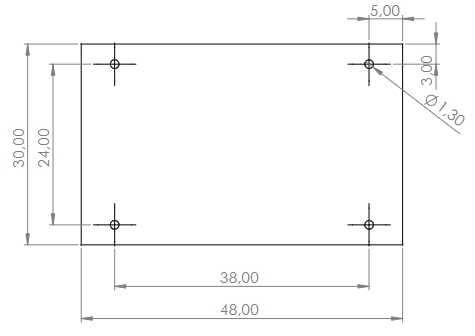

# Train occupancy detection

This project is an electronic board placed under a Märklin C-Track to detect the presence of a train. The board is connected via a second bus on I2C.

RFID tags are placed under the train. The board detects the presence of the train by reading the RFID tags.

The standard NFC used is ISO/IEC 14443 Type A. The RFID tags are MIFARE Classic 1K.

## TODO

- [ ] Find a connector small enough to fit under the track
- [ ] Do a schematic review
- [ ] Finish routing the board
- [ ] Add a resistive measurement on the track to detect the presence of a train
- [ ] Study feasibility of differential I2C-bus with PCA9515
- [ ] Verify antenna matching what L and impedance?
- [ ] Update antenna matching component values

## Antenna matching links

- https://eds.st.com/antenna/#/
- https://eds.st.com/nfc-tuningcircuit/
- [calculator.xls](calculator.xls)
